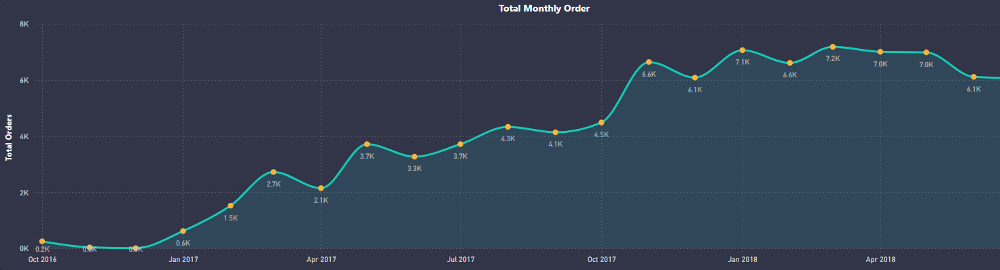

# E-Commerce-Business-Performance-Analysis

## Overview

Olist is a Brazilian e-commerce platform that connects sellers and buyers. The company provides an online marketplace for various products, facilitating transactions between consumers and multiple sellers. This project aims to analyze the data generated from Olist's operations to derive meaningful insights regarding customer behavior, seller performance, delivery efficiency, and sales revenue.

The dataset consists of various CSV files provided by Olist, which encompass different aspects of their e-commerce operations, such as customer information, seller details, order information, payments, product details, and reviews.

## Objectives

### Objective 1 - Database Design and Data Importation

The primary goal of this objective is to load the data into a relational database using PostgreSQL. The Olist dataset consists of nine interconnected tables. The tasks to be completed include:

- Constructing all tables in a defined sequence to establish necessary relationships.
- Choosing suitable data types for the various data fields.
- Implementing primary and foreign keys to facilitate table connections.

### Objective 2 - Exploratory Data Analysis

Once the data has been imported, we will perform Exploratory Data Analysis (EDA) through SQL queries to extract insights from the dataset. The analyses will encompass:

- Customer and Seller Insights
-  Sales and Revenue Insights
- Delivery Performance and Review Analysis

- ## 📊 Interactive Dashboard

An interactive dashboard is included in this repository :

### Page 1

### Page 2


## Objective 1 - Database Design and Data Importation

### **Data Schema** 
A data schema is provided by Olist.


I used this Data schema to understand the data and to figure out the sequence in which the tables should be created and the data should be imported. Based on the understand this is the following sequency in which the tables should be created and data should be imported.

### Code Snippet for Creating Tables and Indexing

In this section, we will create the necessary tables in the PostgreSQL database to store the data from the Olist dataset. Each table will be constructed with appropriate data types and constraints, such as primary and foreign keys. Indexes will also be created to optimize query performance by speeding up data retrieval.

```sql
DROP TABLE IF EXISTS public.olist_geolocation;

/* Create table olist_geolocation table with no primary key 
   because zip code prefix has duplicate values. 
   Also, this table cannot be joined with olist_seller or olist_customers table 
   through zip code prefix because it has duplicate values */
CREATE TABLE public.olist_geolocation (
    geolocation_zip_code_prefix INT,
    geoloacation_lat FLOAT,
    geolocation_lng FLOAT,
    geolocation_city VARCHAR(100),
    geolocation_state CHAR(2)
);

-- Drop table if already exist to ensure multiple runs and clean slate
DROP TABLE IF EXISTS public.Olist_seller;

-- Create table Olist_seller table with primary key 
CREATE TABLE public.Olist_seller (
    seller_id VARCHAR(100) PRIMARY KEY,
    seller_zip_code_prefix INT,
    seller_city VARCHAR(100),
    seller_state CHAR(2)
);

-- Drop table if already exist to ensure multiple runs and clean slate
DROP TABLE IF EXISTS public.olist_customers;

-- Create table olist_Customers with primary key 
CREATE TABLE public.olist_Customers (
    customer_id VARCHAR(100) PRIMARY KEY,
    customer_unique_id VARCHAR(100),
    customer_zip_code_prefix INT,
    customer_city VARCHAR(100),
    customer_state CHAR(2)
);

-- Drop table if already exist to ensure multiple runs and clean slate
DROP TABLE IF EXISTS public.olist_orders;

-- Create table olist_orders table with primary key and foreign key
CREATE TABLE public.olist_orders (
    order_id VARCHAR(100) PRIMARY KEY,
    customer_id VARCHAR(100),
    order_status VARCHAR(100), 
    order_purchase_timestamp TIMESTAMP WITHOUT TIME ZONE,
    order_approved_at TIMESTAMP WITHOUT TIME ZONE,
    order_delivered_carrier_date TIMESTAMP WITHOUT TIME ZONE,
    order_delivered_customer_date TIMESTAMP WITHOUT TIME ZONE,
    order_estimated_delivery_date TIMESTAMP WITHOUT TIME ZONE,
    FOREIGN KEY(customer_id) REFERENCES olist_Customers(customer_id)
);

-- Drop table if already exist to ensure multiple runs and clean slate
DROP TABLE IF EXISTS public.olist_order_reviews;

/* Create table olist_order_review with foreign key
   review_id and order_id has duplicate values so it cannot be primary key */
CREATE TABLE public.olist_order_reviews (
    review_id VARCHAR(100),
    order_id VARCHAR(100),
    review_score INT,
    review_comment_title VARCHAR(255),
    review_comment_message TEXT,
    review_creation_date TIMESTAMP WITHOUT TIME ZONE,
    review_answer_timestamp TIMESTAMP WITHOUT TIME ZONE,
    FOREIGN KEY (order_id) REFERENCES olist_orders(order_id)
);

-- Drop table if already exist to ensure multiple runs and clean slate
DROP TABLE IF EXISTS public.olist_order_payments;

-- Create table olist_order_payments with foreign key
CREATE TABLE public.olist_order_payments (
    order_id VARCHAR(100),
    payment_sequential INT,
    payment_type VARCHAR(100),
    payment_installments INT,
    payment_value NUMERIC(10,2),
    FOREIGN KEY(order_id) REFERENCES olist_orders(order_id)
);

-- Drop table if already exist to ensure multiple runs and clean slate
DROP TABLE IF EXISTS public.olist_product_name_translation;

-- Create table olist_product_name_translation with primary key
CREATE TABLE public.olist_product_name_translation (
    product_category_name VARCHAR(100) PRIMARY KEY,
    product_category_name_english VARCHAR(100)
);

-- Drop table if already exist to ensure multiple runs and clean slate
DROP TABLE IF EXISTS public.olist_products;

-- Create table olist_products with primary key and foreign key
CREATE TABLE public.olist_products (
    product_id VARCHAR(100) PRIMARY KEY,
    product_category_name VARCHAR(100),
    product_name_lenght INT,
    product_description_lenght INT,
    product_photos_qty INT,
    product_weight_g INT,
    product_length_cm INT,
    product_height_cm INT,
    product_width_cm INT,
    FOREIGN KEY (product_category_name) REFERENCES olist_product_name_translation(product_category_name)
);

-- Drop table if already exist to ensure multiple runs and clean slate
DROP TABLE IF EXISTS public.olist_order_items;

-- Create table olist_order_items with primary key and foreign keys
CREATE TABLE public.olist_order_items (
    order_id VARCHAR(100),
    order_item_id INT,
    product_id VARCHAR(100),
    seller_id VARCHAR(100),
    shipping_limit_date TIMESTAMP WITHOUT TIME ZONE,
    price NUMERIC(10,2),
    freight_value NUMERIC(10,2),
    FOREIGN KEY (order_id) REFERENCES olist_orders(order_id),
    FOREIGN KEY (product_id) REFERENCES olist_products(product_id),
    FOREIGN KEY (seller_id) REFERENCES Olist_seller(seller_id)
);

/* Creating indexes for foreign keys to optimize performance
   by reducing the amount of data to be scanned and increasing efficiency
   for join operations */
CREATE INDEX idx_customer_id ON public.olist_orders(customer_id);
CREATE INDEX idx_order_id ON public.olist_order_reviews(order_id);
CREATE INDEX idx_order_id_payment ON public.olist_order_payments(order_id);
CREATE INDEX idx_product_category_name ON public.olist_products(product_category_name);
CREATE INDEX idx_order_id_items ON public.olist_order_items(order_id);
CREATE INDEX idx_product_id ON public.olist_order_items(product_id); 
CREATE INDEX idx_seller_id_items ON public.olist_order_items(seller_id);
```

### Code Snippet for Data Importation 
Next, we will import the data from the CSV files into the corresponding tables we have created. This process involves using the COPY command to load data efficiently.

```sql
-- 1. Import geolocation data
COPY public.olist_geolocation
FROM 'E:\Wasay\coding\DATA ANALYST PORTFOLIO PROJECT\OList E-Commerce Data Analysis SQL Project\data\olist_geolocation_dataset.csv'
WITH (FORMAT csv, HEADER true, DELIMITER ',', ENCODING 'UTF8');

-- 2. Import seller data
COPY public.olist_seller
FROM 'E:\Wasay\coding\DATA ANALYST PORTFOLIO PROJECT\OList E-Commerce Data Analysis SQL Project\data\olist_sellers_dataset.csv'
WITH (FORMAT csv, HEADER true, DELIMITER ',', ENCODING 'UTF8');

-- 3. Import customer data
COPY public.olist_Customers
FROM 'E:\Wasay\coding\DATA ANALYST PORTFOLIO PROJECT\OList E-Commerce Data Analysis SQL Project\data\olist_customers_dataset.csv'
WITH (FORMAT csv, HEADER true, DELIMITER ',', ENCODING 'UTF8');

-- 4. Import order data
COPY public.olist_orders
FROM 'E:\Wasay\coding\DATA ANALYST PORTFOLIO PROJECT\OList E-Commerce Data Analysis SQL Project\data\olist_orders_dataset.csv'
WITH (FORMAT csv, HEADER true, DELIMITER ',', ENCODING 'UTF8');

-- 5. Import order reviews data
COPY public.olist_order_reviews
FROM 'E:\Wasay\coding\DATA ANALYST PORTFOLIO PROJECT\OList E-Commerce Data Analysis SQL Project\data\olist_order_reviews_dataset.csv'
WITH (FORMAT csv, HEADER true, DELIMITER ',', ENCODING 'UTF8');

-- 6. Import order payments data
COPY public.olist_order_payments
FROM 'E:\Wasay\coding\DATA ANALYST PORTFOLIO PROJECT\OList E-Commerce Data Analysis SQL Project\data\olist_order_payments_dataset.csv'
WITH (FORMAT csv, HEADER true, DELIMITER ',', ENCODING 'UTF8');

-- 7. Import product name
COPY public.olist_product_name_translation
FROM 'E:\Wasay\coding\DATA ANALYST PORTFOLIO PROJECT\OList E-Commerce Data Analysis SQL Project\data\product_category_name_translation.csv'
WITH (FORMAT csv, HEADER true, DELIMITER ',', ENCODING 'UTF8');

-- 8. Import product data
COPY public.olist_products
FROM 'E:\Wasay\coding\DATA ANALYST PORTFOLIO PROJECT\OList E-Commerce Data Analysis SQL Project\data\olist_products_dataset.csv'
WITH (FORMAT csv, HEADER true, DELIMITER ',', ENCODING 'UTF8');

-- 9. Import order items data
COPY public.olist_order_items
FROM 'E:\Wasay\coding\DATA ANALYST PORTFOLIO PROJECT\OList E-Commerce Data Analysis SQL Project\data\olist_order_items_dataset.csv'
WITH (FORMAT csv, HEADER true, DELIMITER ',', ENCODING 'UTF8');
```
### **Entity Relationship Diagram** 


This diagram illustrates all the relations between the different tables that I created.

## Objective 2 - Exploratory Data Analysis

Once the data has been imported, we will perform Exploratory Data Analysis (EDA) through SQL queries to extract insights from the dataset. The analyses will encompass:

- Customer and Seller Insights
- Sales and Revenue Insights
- Delivery Performance and Review Analysis

### **Customer and Seller Analysis**

Questions are : 

 **1. What are the top 10 cities with most customers?**
```SQL
SELECT 
    customer_city, 
    COUNT(customer_unique_id) AS total_customers  -- Count of unique customers in each city
FROM 
    olist_customers  -- Customer data table
GROUP BY 
    customer_city    -- Grouping by city to get the count per city
ORDER BY 
    total_customers DESC  -- Ordering by the highest number of customers
LIMIT 10;  -- Limiting the result to the top 10 cities
 ```
**Visualization :**


**Observation :**

Sao Paulo has the largert customer base for Olist. 


 **2. What are the top 10 states with the most customers?**
```SQL
SELECT 
    customer_state, 
    COUNT(customer_unique_id) AS total_customers  -- Count of unique customers in each state
FROM 
    olist_customers  -- Customer data table
GROUP BY 
    customer_state   -- Grouping by state to get the count per state
ORDER BY 
    total_customers DESC  -- Ordering by the highest number of customers
LIMIT 10;  -- Limiting the result to the top 10 states
 ```
**Visualization :**


**Observation :**

State of Sao Paulo has the largert customer base for Olist. 

 **3. Find the top 10 cities with the most customers and their respective states.**
```SQL
WITH top_customer_cities AS (  -- Using a CTE to organize the result for ranking cities
    SELECT 
        customer_state, 
        customer_city, 
        COUNT(customer_unique_id) AS total_customers,  -- Count of customers in each city
        ROW_NUMBER() OVER (ORDER BY COUNT(customer_unique_id) DESC) AS city_rank  -- Ranking cities by the number of customers
    FROM 
        olist_customers  -- Customer data table
    GROUP BY 
        customer_state, customer_city  -- Grouping by both state and city to aggregate the data
)
SELECT 
    customer_state, 
    customer_city, 
    total_customers  -- Displaying the state, city, and the total number of customers
FROM 
    top_customer_cities  -- Using the CTE to select the top cities
WHERE 
    city_rank <= 10  -- Filtering only the top 10 cities
ORDER BY 
    total_customers DESC;  -- Ordering by the number of customers
 ```
**Visualization :**


**Observation :**

State of Sao Paulo has the 4 cities which have largest customer base for Olist.

 ** 4. What are the top 10 cities with the most sellers?**
```SQL
SELECT 
    seller_city, 
    COUNT(seller_id) AS total_sellers  -- Count of sellers in each city
FROM 
    olist_seller  -- Seller data table
GROUP BY 
    seller_city    -- Grouping by city to get the count per city
ORDER BY 
    total_sellers DESC  -- Ordering by the highest number of sellers
LIMIT 10;  -- Limiting the result to the top 10 cities
 ```
**Visualization :**


**Observation :**

 Sao Paulo has the most number of sellers for Olist.
 
 ** 5. What are the top 10 states with the most sellers?**
```SQL
SELECT 
    seller_state, 
    COUNT(seller_id) AS total_sellers  -- Count of sellers in each state
FROM 
    olist_sellers  -- Seller data table
GROUP BY 
    seller_state   -- Grouping by state to get the count per state
ORDER BY 
    total_sellers DESC  -- Ordering by the highest number of sellers
LIMIT 10;  -- Limiting the result to the top 10 states
 ```
**Visualization :**


**Observation :**

State of São Paulo has the most number of sellers for Olist.

 ** 6. Find the top 10 cities with the most sellers and their respective states.**
```SQL
WITH top_seller_cities AS (  -- Using a CTE to organize the result for ranking cities
    SELECT 
        seller_state, 
        seller_city, 
        COUNT(seller_id) AS total_sellers,  -- Count of sellers in each city
        ROW_NUMBER() OVER (ORDER BY COUNT(seller_id) DESC) AS city_rank  -- Ranking cities by the number of sellers
    FROM 
        olist_seller  -- Seller data table
    GROUP BY 
        seller_state, seller_city  -- Grouping by both state and city to aggregate the data
)
SELECT 
    seller_state, 
    seller_city, 
    total_sellers  -- Displaying the state, city, and the total number of sellers
FROM 
    top_seller_cities  -- Using the CTE to select the top cities
WHERE 
    city_rank <= 10  -- Filtering only the top 10 cities
ORDER BY 
    total_sellers DESC;  -- Ordering by the number of sellers

 ```
**Visualization :**


**Observation :**

60% of the top 10 sellers are from the State of Sao Paulo.

Also from the visualizations it is clear that State of Sao Paulo and city of Sao Pualo has the largest customer and seller base.

### **Sales And Revenue Analysis**

Questions are : 

 **1. Find the top 10 most expensive product categories by average product price**
```SQL
SELECT 
    prod.product_category_name,
    trans.product_category_name_english,
    AVG(items.price) AS avg_price  -- Calculating average price of products
FROM 
    olist_order_items items
JOIN 
    olist_products prod ON items.product_id = prod.product_id
JOIN 
    olist_product_name_translation trans ON trans.product_category_name = prod.product_category_name
GROUP BY 
    prod.product_category_name, 
    trans.product_category_name_english
ORDER BY 
    avg_price DESC  -- Ordering by the most expensive
LIMIT 10;  -- Limiting to top 10
 ```

**Visualization :**


 **2. Find the top 10 cheapest product categories by average product price**
```SQL
SELECT 
    prod.product_category_name,
    trans.product_category_name_english,
    AVG(items.price) AS avg_price  -- Calculating average price of products
FROM 
    olist_order_items items
JOIN 
    olist_products prod ON items.product_id = prod.product_id
JOIN 
    olist_product_name_translation trans ON trans.product_category_name = prod.product_category_name
GROUP BY 
    prod.product_category_name, 
    trans.product_category_name_english
ORDER BY 
    avg_price ASC  -- Ordering by the cheapest
LIMIT 10;
 ```

**Visualization :**


 **3. Find the top 10 most ordered product categories**
```SQL
SELECT 
    prod.product_category_name,
    trans.product_category_name_english,
    COUNT(items.product_id) AS total_orders  -- Counting the number of orders per category
FROM 
    olist_order_items items
JOIN 
    olist_products prod ON items.product_id = prod.product_id
JOIN 
    olist_product_name_translation trans ON trans.product_category_name = prod.product_category_name
GROUP BY 
    prod.product_category_name, 
    trans.product_category_name_english
ORDER BY 
    total_orders DESC  -- Ordering by the most ordered
LIMIT 10;
 ```
**Visualization :**


 **4. Find the most used payment method for orders**
```SQL
WITH order_payments AS (
    SELECT 
        order_id, 
        payment_type
    FROM 
        olist_order_payments
),
order_items AS (
    SELECT 
        order_id, 
        product_id
    FROM 
        olist_order_items
),
order_products AS (
    SELECT 
        product_id, 
        product_category_name
    FROM 
        olist_products
),
english_names AS (
    SELECT 
        product_category_name, 
        product_category_name_english
    FROM 
        olist_product_name_translation
)
SELECT 
    payments.payment_type, 
    COUNT(payments.payment_type) AS total_usage  -- Counting the usage of each payment method
FROM 
    order_payments payments
JOIN 
    order_items items ON payments.order_id = items.order_id
JOIN 
    order_products products ON items.product_id = products.product_id
JOIN 
    english_names names ON products.product_category_name = names.product_category_name
GROUP BY 
    payments.payment_type
ORDER BY 
    total_usage DESC;  -- Ordering by the most used payment type
 ```
**Visualization :**


 **5. Find the distribution of payment installments**
```SQL
WITH PaymentInstallmentsCount AS (
    SELECT 
        payment_installments, 
        COUNT(order_id) AS installment_count  -- Counting the number of orders with each installment option
    FROM 
        olist_order_payments
    GROUP BY 
        payment_installments
    ORDER BY 
        payment_installments ASC
),
TotalOrders AS (
    SELECT 
        COUNT(order_id) AS total_order_count  -- Counting the total number of orders
    FROM 
        olist_order_payments
)
SELECT 
    installments.payment_installments, 
    installments.installment_count, 
    (installments.installment_count::FLOAT / total.total_order_count) * 100 AS percentage  -- Calculating percentage of orders using each installment option
FROM 
    PaymentInstallmentsCount installments, 
    TotalOrders total;

 ```
**Visualization :**


 **6. Find the total number of orders per year and month**
```SQL
SELECT 
    EXTRACT(YEAR FROM order_purchase_timestamp) AS order_year,  -- Extracting the year from the order date
    EXTRACT(MONTH FROM order_purchase_timestamp) AS order_month,  -- Extracting the month from the order date
    COUNT(order_id) AS total_orders  -- Counting the total number of orders
FROM 
    olist_orders
GROUP BY 
    order_year, order_month
ORDER BY 
    order_year, order_month;  -- Ordering by year and month

 ```
**Visualization :**



 **7. Find the total sales revenue per year and month**
```SQL
SELECT 
    EXTRACT(YEAR FROM order_purchase_timestamp) AS order_year,  -- Extracting the year from the order date
    EXTRACT(MONTH FROM order_purchase_timestamp) AS order_month,  -- Extracting the month from the order date
    COUNT(order_id) AS total_orders  -- Counting the total number of orders
FROM 
    olist_orders
GROUP BY 
    order_year, order_month
ORDER BY 
    order_year, order_month;  -- Ordering by year and month

 ```
**Visualization :**


 **8. Find the average freight paid by customers**
```SQL
SELECT 
    AVG(freight_value) AS avg_freight_cost  -- Calculating the average freight cost per order
FROM 
    olist_order_items;

 ```
**Visualization :**

### **Customer and Seller Analysis**

Questions are : 

 **1. What are the top 10 cities with most customers?**
```SQL
SELECT 
    customer_city, 
    COUNT(customer_unique_id) AS total_customers  -- Count of unique customers in each city
FROM 
    olist_customers  -- Customer data table
GROUP BY 
    customer_city    -- Grouping by city to get the count per city
ORDER BY 
    total_customers DESC  -- Ordering by the highest number of customers
LIMIT 10;  -- Limiting the result to the top 10 cities
 ```
**Visualization :**


**Observation :**

Sao Paulo has the largert customer base for Olist. 


 **2. What are the top 10 states with the most customers?**
```SQL
SELECT 
    customer_state, 
    COUNT(customer_unique_id) AS total_customers  -- Count of unique customers in each state
FROM 
    olist_customers  -- Customer data table
GROUP BY 
    customer_state   -- Grouping by state to get the count per state
ORDER BY 
    total_customers DESC  -- Ordering by the highest number of customers
LIMIT 10;  -- Limiting the result to the top 10 states
 ```
**Visualization :**


**Observation :**

 **3. Find the top 10 cities with the most customers and their respective states.**
```SQL
WITH top_customer_cities AS (  -- Using a CTE to organize the result for ranking cities
    SELECT 
        customer_state, 
        customer_city, 
        COUNT(customer_unique_id) AS total_customers,  -- Count of customers in each city
        ROW_NUMBER() OVER (ORDER BY COUNT(customer_unique_id) DESC) AS city_rank  -- Ranking cities by the number of customers
    FROM 
        olist_customers  -- Customer data table
    GROUP BY 
        customer_state, customer_city  -- Grouping by both state and city to aggregate the data
)
SELECT 
    customer_state, 
    customer_city, 
    total_customers  -- Displaying the state, city, and the total number of customers
FROM 
    top_customer_cities  -- Using the CTE to select the top cities
WHERE 
    city_rank <= 10  -- Filtering only the top 10 cities
ORDER BY 
    total_customers DESC;  -- Ordering by the number of customers
 ```
**Visualization :**


**Observation :**

 ** 4. What are the top 10 cities with the most sellers?**
```SQL
SELECT 
    seller_city, 
    COUNT(seller_id) AS total_sellers  -- Count of sellers in each city
FROM 
    olist_seller  -- Seller data table
GROUP BY 
    seller_city    -- Grouping by city to get the count per city
ORDER BY 
    total_sellers DESC  -- Ordering by the highest number of sellers
LIMIT 10;  -- Limiting the result to the top 10 cities
 ```
**Visualization :**


**Observation :**

 ** 5. What are the top 10 states with the most sellers?**
```SQL
SELECT 
    seller_state, 
    COUNT(seller_id) AS total_sellers  -- Count of sellers in each state
FROM 
    olist_sellers  -- Seller data table
GROUP BY 
    seller_state   -- Grouping by state to get the count per state
ORDER BY 
    total_sellers DESC  -- Ordering by the highest number of sellers
LIMIT 10;  -- Limiting the result to the top 10 states
 ```
**Visualization :**


**Observation :**

 ** 6. Find the top 10 cities with the most sellers and their respective states.**
```SQL
WITH top_seller_cities AS (  -- Using a CTE to organize the result for ranking cities
    SELECT 
        seller_state, 
        seller_city, 
        COUNT(seller_id) AS total_sellers,  -- Count of sellers in each city
        ROW_NUMBER() OVER (ORDER BY COUNT(seller_id) DESC) AS city_rank  -- Ranking cities by the number of sellers
    FROM 
        olist_seller  -- Seller data table
    GROUP BY 
        seller_state, seller_city  -- Grouping by both state and city to aggregate the data
)
SELECT 
    seller_state, 
    seller_city, 
    total_sellers  -- Displaying the state, city, and the total number of sellers
FROM 
    top_seller_cities  -- Using the CTE to select the top cities
WHERE 
    city_rank <= 10  -- Filtering only the top 10 cities
ORDER BY 
    total_sellers DESC;  -- Ordering by the number of sellers

 ```
**Visualization :**


**Observation :**

### **Delivery and Review Analysis**

Questions are : 

 **1. Find the average time it takes after the purchase for the payment to be approved.**
```SQL
SELECT 
    AVG(order_approved_at - order_purchase_timestamp) AS avg_time_to_approval  -- Average time for payment approval
FROM 
    olist_orders
WHERE 
    order_status = 'delivered';  -- Considering only delivered orders
 ```

Results

For Max
```Json
{ "days": 30, "hours": 21, "minutes": 26, "seconds": 37}
```
For Min
```Json
{}
```
The MIN value is 0 because purchase time and order time is same for some orders.

For Avg
```Json
{ "hours": 10, "minutes": 16, "seconds": 36, "milliseconds": 361.244}
```

 **2. Find the slowest and fastest delivery times.**
```SQL
-- Slowest delivery time
SELECT 
    MAX(order_delivered_customer_date - order_purchase_timestamp) AS slowest_delivery_time  -- Max difference between delivery and purchase
FROM 
    olist_orders
WHERE 
    order_status = 'delivered';

-- Fastest delivery time
SELECT 
    MIN(order_delivered_customer_date - order_purchase_timestamp) AS fastest_delivery_time  -- Min difference between delivery and purchase
FROM 
    olist_orders
WHERE 
    order_status = 'delivered';
 ```
Results

```Json
{"days": 209,"hours": 15,"minutes": 5,"seconds": 12}
```
For fastest
```SQL 
select min(order_delivered_customer_date - order_purchase_timestamp) as fastest_delivery from olist_orders
where order_status= 'delivered'
;
```
Results

```Json
{"hours": 12, "minutes": 48,"seconds": 7}
```

**3. Find the average delivery time.**
```SQL
SELECT 
    AVG(order_delivered_customer_date - order_purchase_timestamp) AS avg_delivery_time  -- Average time taken for delivery
FROM 
    olist_orders
WHERE 
    order_status = 'delivered';
 ```
Results

```Json
{"days": 12, "hours": 13, "minutes": 23, "seconds": 49, "milliseconds": 957.272
}
```
** 4. Find the average, max, and min difference between actual delivery and estimated delivery.**
```SQL
-- Maximum difference between estimated and actual delivery dates
SELECT 
    MAX(order_estimated_delivery_date - order_delivered_customer_date) AS max_delivery_diff  -- Maximum delay
FROM 
    olist_orders
WHERE 
    order_status = 'delivered';

-- Minimum difference between estimated and actual delivery dates
SELECT 
    MIN(order_estimated_delivery_date - order_delivered_customer_date) AS min_delivery_diff  -- Minimum delay or early delivery
FROM 
    olist_orders
WHERE 
    order_status = 'delivered';

-- Average difference between estimated and actual delivery dates
SELECT 
    AVG(order_estimated_delivery_date - order_delivered_customer_date) AS avg_delivery_diff  -- Average delay or early delivery
FROM 
    olist_orders
WHERE 
    order_status = 'delivered';
 ```
Results

```Json
"avg_discrepency": {"days": 10,"hours": 28, "minutes": 16, "seconds": 30, "milliseconds": 62.973}
"max_discrepency": { "days": 146,  "minutes": 23, "seconds": 13}
"min_discrepency": { "days": -188,"hours": -23, "minutes": -24,"seconds": -7}

```

** 5. Find the count of all review scores and the percentage for each review score.**
```SQL
WITH review_counts AS (
    -- Step 1: Count the number of reviews for each score
    SELECT 
        review_score, 
        COUNT(order_id) AS score_count  -- Count of reviews per score
    FROM 
        olist_order_reviews
    GROUP BY 
        review_score
),
total_reviews AS (
    -- Step 2: Calculate the total number of reviews
    SELECT 
        COUNT(order_id) AS total_count  -- Total number of reviews
    FROM 
        olist_order_reviews
)
SELECT 
    rc.review_score, 
    rc.score_count, 
    (rc.score_count::FLOAT / tr.total_count) * 100 AS percentage  -- Percentage calculation
FROM 
    review_counts rc, total_reviews tr
ORDER BY 
    rc.review_score DESC;  -- Order by review score
 ```
**Visualization :**


** 6. Find the relation between delivery time and review score.**
```SQL
-- Relation for delivery time < 14 days
WITH relation_delivery_reviews AS (
    SELECT 
        orders.order_id, 
        (orders.order_delivered_customer_date - orders.order_purchase_timestamp) AS delivery_time,  -- Delivery time calculation
        reviews.review_score
    FROM 
        olist_orders AS orders
    JOIN 
        olist_order_reviews AS reviews
    ON 
        reviews.order_id = orders.order_id
    WHERE 
        orders.order_status = 'delivered' AND orders.order_delivered_customer_date IS NOT NULL
)
SELECT 
    AVG(review_score) AS avg_review_score_14_days  -- Average review score for deliveries < 14 days
FROM 
    relation_delivery_reviews
WHERE 
    delivery_time < INTERVAL '14 days';

-- Relation for delivery time between 14 and 21 days
WITH relation_delivery_reviews AS (
    SELECT 
        orders.order_id, 
        (orders.order_delivered_customer_date - orders.order_purchase_timestamp) AS delivery_time,
        reviews.review_score
    FROM 
        olist_orders AS orders
    JOIN 
        olist_order_reviews AS reviews
    ON 
        reviews.order_id = orders.order_id
    WHERE 
        orders.order_status = 'delivered' AND orders.order_delivered_customer_date IS NOT NULL
)
SELECT 
    AVG(review_score) AS avg_review_score_14_to_21_days  -- Average review score for deliveries between 14 and 21 days
FROM 
    relation_delivery_reviews
WHERE 
    delivery_time BETWEEN INTERVAL '14 days' AND INTERVAL '21 days';

-- Relation for delivery time between 21 and 28 days
WITH relation_delivery_reviews AS (
    SELECT 
        orders.order_id, 
        (orders.order_delivered_customer_date - orders.order_purchase_timestamp) AS delivery_time,
        reviews.review_score
    FROM 
        olist_orders AS orders
    JOIN 
        olist_order_reviews AS reviews
    ON 
        reviews.order_id = orders.order_id
    WHERE 
        orders.order_status = 'delivered' AND orders.order_delivered_customer_date IS NOT NULL
)
SELECT 
    AVG(review_score) AS avg_review_score_21_to_28_days  -- Average review score for deliveries between 21 and 28 days
FROM 
    relation_delivery_reviews
WHERE 
    delivery_time BETWEEN INTERVAL '21 days' AND INTERVAL '28 days';

-- Relation for delivery time > 35 days
WITH relation_delivery_reviews AS (
    SELECT 
        orders.order_id, 
        (orders.order_delivered_customer_date - orders.order_purchase_timestamp) AS delivery_time,
        reviews.review_score
    FROM 
        olist_orders AS orders
    JOIN 
        olist_order_reviews AS reviews
    ON 
        reviews.order_id = orders.order_id
    WHERE 
        orders.order_status = 'delivered' AND orders.order_delivered_customer_date IS NOT NULL
)
SELECT 
    AVG(review_score) AS avg_review_score_above_35_days  -- Average review score for deliveries over 35 days
FROM 
    relation_delivery_reviews
WHERE 
    delivery_time > INTERVAL '35 days';
 ```

**Visualization :**


**Observation :**
If the product is delivered with in 2 weeks the avg rating is 4.35
If the product is delivered with in 2 weeks to 3 weeks the avg rating drops to 4.13
If the product is delivered with in 3 weeks to 4 weeks the avg rating drops to 3.6
If the product is delivered with in 4 weeks to 5 weeks the avg rating drops to 2.8
If the product is delivered after 5 weeks the avg rating drops to 1.9
